Ruby on Rails で簡単な掲示板を作る
---

# Step 1. Ruby と Rails のインストール

Ruby と Rails をインストールしていない人は、[Rails Girls インストール・レシピ](http://railsgirls.jp/install/) を参考にインストールしましょう。

注意: Mac の方は、OS のバージョンに依らず、**3-A. rbenv を使って Ruby と Ruby on Rails をインストール(OS X 10.9 以上の場合)** を選択してください。

# Step 2. Rails で新しいプロジェクトを作る

keijiban プロジェクトを作ります。
ターミナルで、以下のコマンドを入力すると keijiban というディレクトリ (フォルダ) が作られ、新しい Rails のアプリケーションを実行できる環境がセットアップされます。 (これには少し時間がかかります)

```
rails new keijiban
```

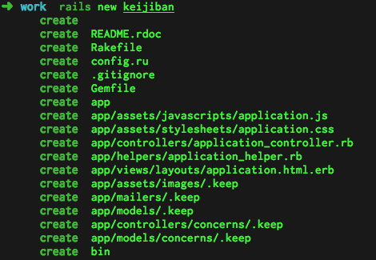

# Step 3. Rails のウェブサーバを立ち上げてみる

`cd keijiban` で keijiban ディレクトリに移動した後、 `rails server` コマンドを入力してみましょう。
以下の様な情報が表示されるはずです。
これで、keijiban アプリのためのウェブサーバが立ち上がりました。

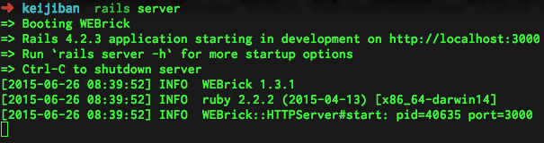

それから、ブラウザを開いて http://localhost:3000 にアクセスしてみてください。
次のようなページが開きます。

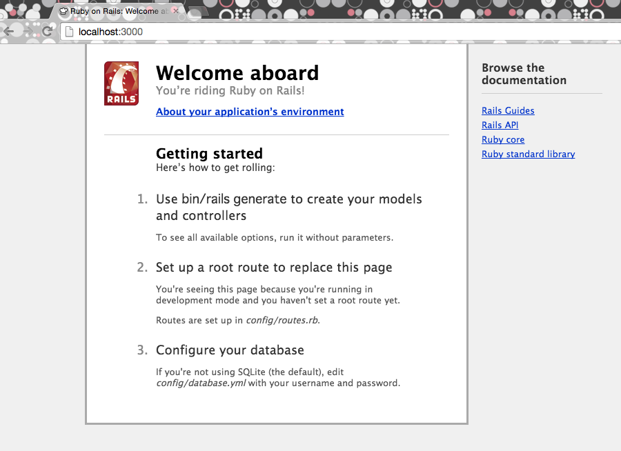

これは先ほど立ち上げたウェブサーバから配信されているものです。

# Step 4. 掲示板の画面と投稿の仕組みを一気に作る

ターミナルに戻って、サーバを一旦止めましょう。
`Ctrl` キーと `c` キーを同時に押すとサーバが停止します。

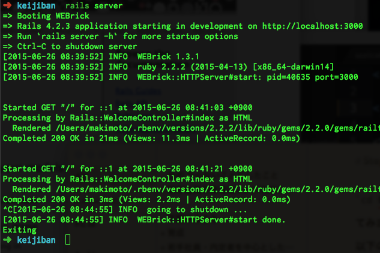

さて、続いて、以下のコマンドを入力してください。

```
rails generate scaffold post title:string name:string body:text
```

これは Rails の機能を使ってアプリを開発するための足場 (`scaffold`) を作るコマンドです。
具体的には、 `post` という投稿された記事の情報を管理するモデルと、記事を追加したり消したりするための仕組みを一気につくります。

`title:string body:text name:string` は、それぞれ投稿された記事がタイトル (`title`)、投稿者名 (`name`)、本文 (`body`) という情報を含むことを意味します。

このコマンドを実行すると、以下のように表示されます。

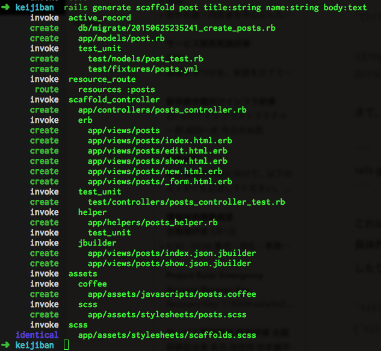

これで、投稿記事のためのコードが作られました。

投稿記事の情報をアプリが保存するためには、データベースが必要です。
今回は sqlite というデータベースを使います。 (これは、すでに **Step 1** でセットアップされています)
以下のコマンドで、データベースに投稿記事を保存するためのテーブルを作ります。

```
rake db:migrate
```

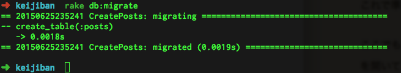

これで準備ができました。

ここでもう一度 `rails server` でサーバを立ち上げて、今度は http://localhost:3000/posts を開いてください。(post ではなく post**s** であることに注意)

以下のようなページが表示されるはずです。

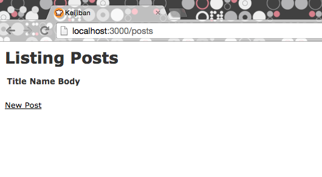

ここまで来ると、すでに記事を投稿することができるようになっています。

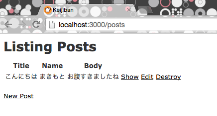

# Step 5. より掲示板らしくする1: 記事一覧から投稿できるようにする

さて、ここでいよいよコードを編集してより掲示場らしくして行きましょう。
まず、記事一覧のページから直接投稿できるようにしましょう。

投稿一覧ページ (http://localhost:3000/posts) の実体は `app/views/posts/index.html.erb` というファイルです。

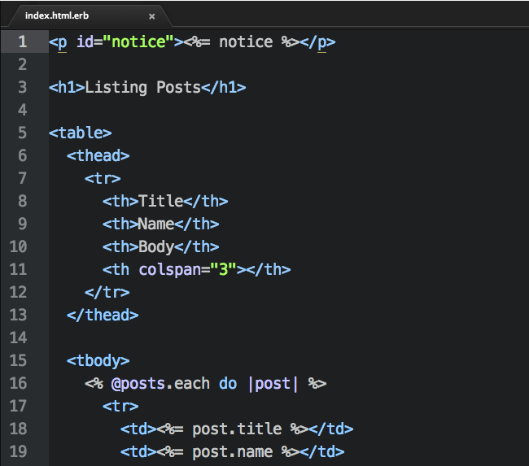

ここに、投稿フォームを追加しましょう。

新規投稿のページは `app/views/posts/new.html.erb` というファイルです。

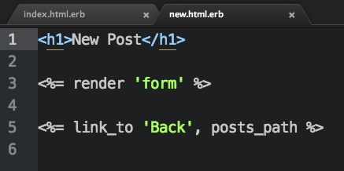

ここを見ると、どうやら `<%= render ‘form’ %>` という部分がフォームを表示させているようです。

これは、同じディレクトリにある別のファイル `_form.html.erb` を表示させる機能です。

`_form.html.erb` の中身は以下の様になっています。

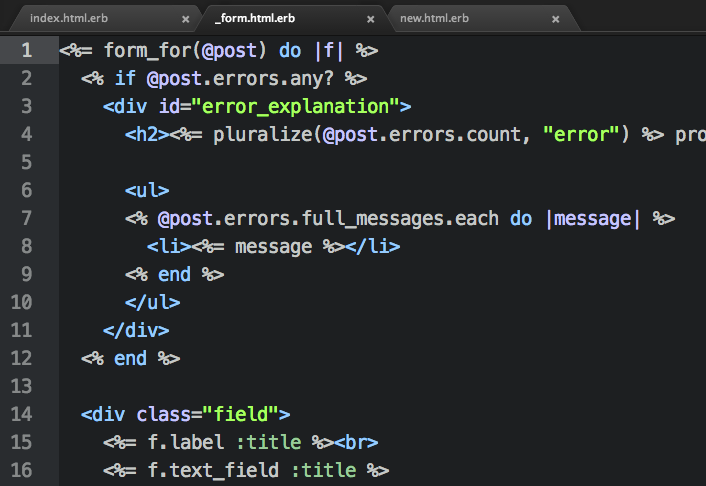

これを `index.html.erb` に持って行きましょう。

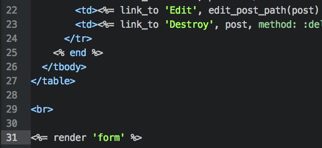

さて、もう一度 http://localhost:3000/posts を開いてみると、残念ながらエラー画面が表示されます。

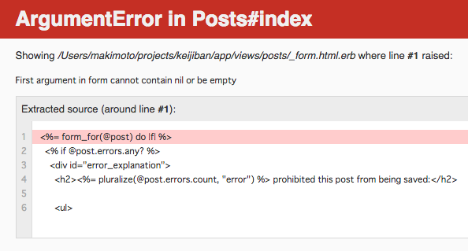

`First argument in form cannot contain nil or be empty` ということで、赤く表示されている `<%= form_for(@post) do |f| %>` の `@post` が nil か空になっているのが原因のようです。

これを解決するためには、投稿記事の表示やデータ出し入れを管理している `app/controllers/posts_controller.rb` を見に行く必要があります。

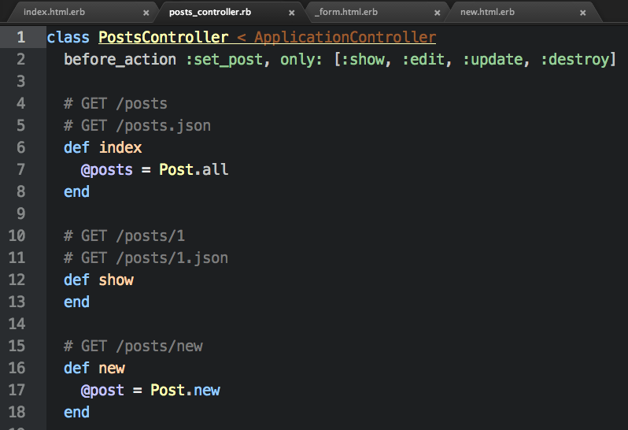

ここの `index` という記事一覧を管理しているメソッドに `new` という新規投稿画面を管理しているメソッドにあるように `@post` を追加しましょう。

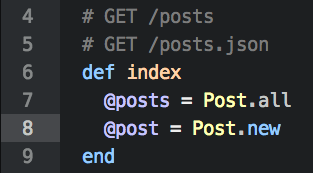

これで、記事一覧の画面に投稿フォームを表示することができるようになりました。

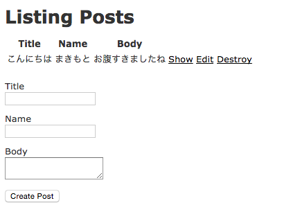

この段階では、投稿したら別のページに遷移していまいます。

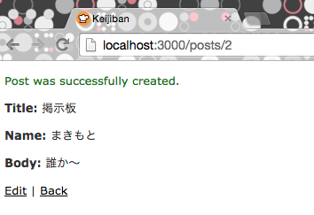

投稿した後も投稿一覧のページに戻るようにするには、投稿記事を作成する `create` メソッド内の、リダイレクト先設定 (`redirect_to`) を `posts_path` に変更します。

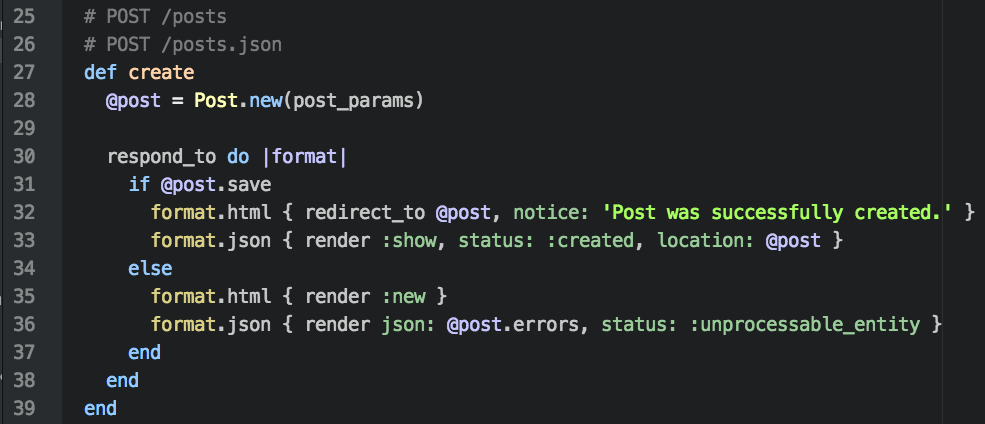

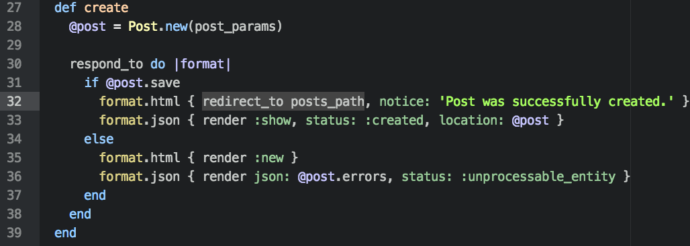

これで新規投稿したら投稿一覧に戻るようになりました。

# Step 6: より掲示板らしくする2: デザインを多少ましにする

今のままでは掲示板っぽくないので、掲示板っぽいデザインになるように見た目を変更します。

掲示板の投稿情報は `index.html.erb` の以下の部分で作られています。

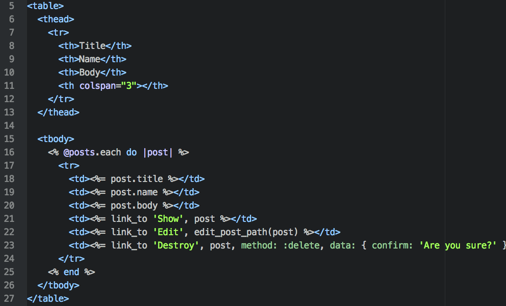

ここで、`<%=` と `%>` で囲まれている `post.title` `post.name` `post.body` が、それぞれ記事のタイトル、投稿者、本文です。

ここを次のように変更してみます。

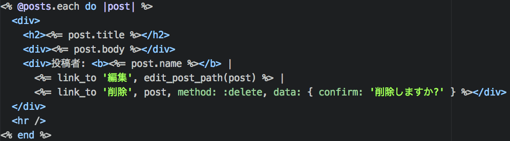

すると、次のような見た目になります。

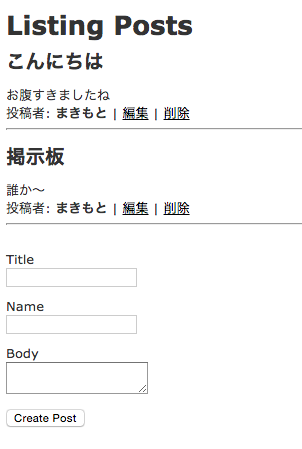

# Step 7: トップページを記事一覧にする

ここまで、記事一覧を表示する URL は http://localhost:3000/posts でした。
これを http://localhost:3000 にアクセスすると直接見られるようにします。

どの URL でどの画面を表示するのかを管理しているのは、 `config/routes.rb` というファイルです。
これまで触ってきた `/posts` で記事一覧が表示されたりするのも、 `resources :posts` という命令によって設定されていたものです。

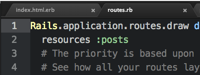

ここに、 `root to: ‘posts#index’` と追記すると、 http://localhost:3000 で表示されるのが `posts` の `index`、つまり記事一覧になります。

# まとめ

以上の手順で簡単な掲示板を作ることが出来ました。
ここまでで作ったアプリを公開してみました。

> https://keijiban-sample.herokuapp.com/

(見た目は多少アレですが、) ちゃんと動くウェブアプリケーションになりました

# Rails でアプリを書き始めたい人のためのリソース

* Ruby on Rails チュートリアル
	* http://railstutorial.jp/ (日本語)
	* https://www.railstutorial.org/book (英語)
* Rails Girls ガイド
	* http://railsgirls.jp/ (日本語)
	* http://guides.railsgirls.com/
